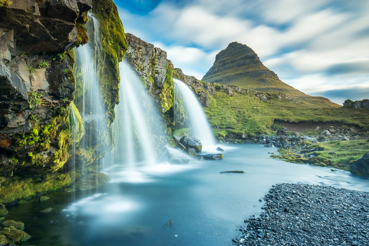
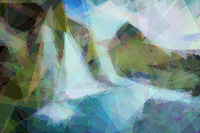

# Genetic Art Evolution

Approximate any image using a population of semi-transparent triangles, evolved over generations using a genetic algorithm.




> *Top: target image. Bottom: evolved approximation after 100,000 generations.*

---

## How It Works

1. A **population** of individuals is created, each holding N random triangles
2. Each individual is **rendered** to a pixel buffer and compared against the target image using mean squared error
3. The **fittest** individuals (lowest error) are selected as parents via tournament selection
4. **Crossover** blends two parents' triangle genes to produce a child
5. **Mutation** randomly jiggles positions, shifts colors, resets triangles entirely, or swaps draw order (z-order)
6. If the population stops improving, a **stuck counter** escalates mutation aggressiveness to escape local optima
7. Repeat until convergence or max generations is reached

---

## Dependencies

| Dependency | Purpose |
|---|---|
| [SDL2](https://www.libsdl.org/) | Real-time visualisation window |
| [stb_image](https://github.com/nothings/stb) | Image loading |
| [stb_image_resize2](https://github.com/nothings/stb) | Image downscaling |
| OpenMP | Parallelism (fitness evaluation + rendering) |

> `stb_image.h` and `stb_image_resize2.h` are single-header libraries — just drop them in the project root.

### Installing SDL2

**Ubuntu/Debian**
```bash
sudo apt install libsdl2-dev
```

**macOS**
```bash
brew install sdl2
```

**Windows**
Download the development libraries from [libsdl.org](https://www.libsdl.org/download-2.0.php) and link accordingly.

---

## Building

```bash
make
```

To build without OpenMP (single-threaded):
```bash
make NO_OMP=1
```

---

## Usage

```bash
./genetic [options]
```

| Flag | Long form | Default | Description |
|---|---|---|---|
| `-i` | `--input` | `target.jpg` | Input image file |
| `-o` | `--output` | `output.bmp` | Output BMP filename |
| `-t` | `--triangles` | `100` | Number of triangles per individual |
| `-p` | `--population` | `10` | Population size |
| `-g` | `--generations` | `40000` | Maximum generations |
| `-w` | `--width` | `200` | Downscale input to this width (px) |
| `-e` | `--epsilon` | `0.002` | Fitness threshold to stop early |
| `-s` | `--stuck` | `800` | Generations without improvement before escalating mutation |
| | `--no-vis` | off | Disable SDL visualisation (headless mode) |
| `-h` | `--help` | | Print usage |

### Examples

```bash
# Basic usage
./genetic -i photo.jpg

# Higher quality, slower
./genetic -i photo.jpg -t 300 -p 50 -w 400 -g 100000

# Headless with custom output
./genetic -i portrait.jpg -o portrait_out.bmp --no-vis

# Tune stuck threshold if evolution keeps stalling
./genetic -i photo.jpg -s 1500
```

---

## Tips for Good Results

- **Width** has the biggest impact on speed. `200` is a good default; drop to `150` for faster iteration, raise to `300+` for finer detail
- **More triangles** = more expressive but slower per generation. Start with `100`, go up to `300` for complex images
- **Population size** of `10–30` is usually sufficient. Larger populations slow each generation but explore more
- **Simple, high-contrast images** evolve much faster than photos with fine detail
- If the fitness stops improving early, try increasing `--stuck` or `--triangles`

---

## Project Structure

```
.
├── main.c          # Entry point, CLI parsing, evolution loop
├── genetic.c/h     # Individual, mutation, crossover, RNG
├── render.c/h      # Triangle rasterizer, fitness function
├── image.c/h       # Image loading and resizing (via stb)
├── Makefile
├── stb_image.h            # (libary I've used)
└── stb_image_resize2.h    # (libary I've used) 
```

---
